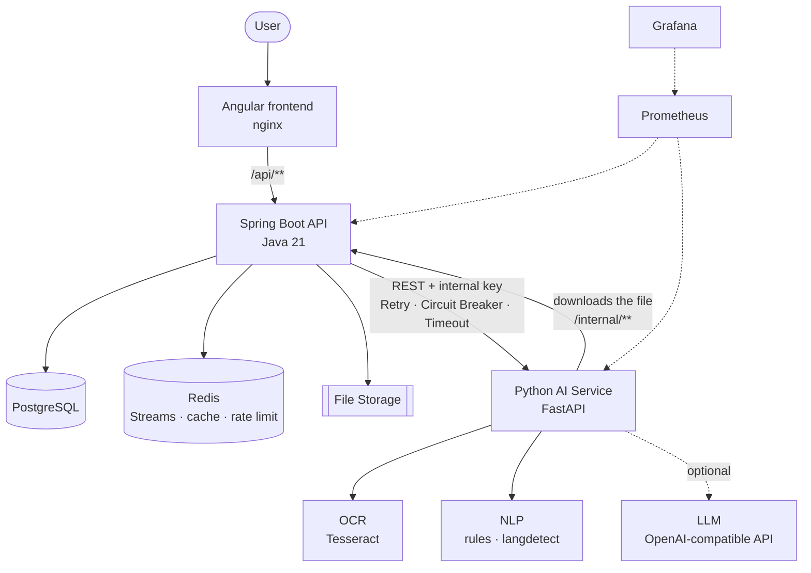
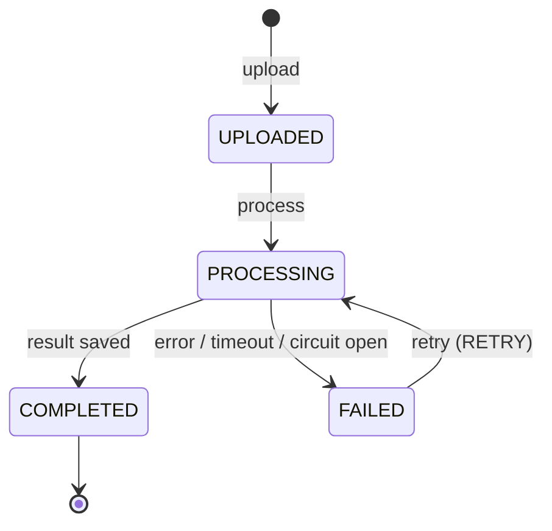
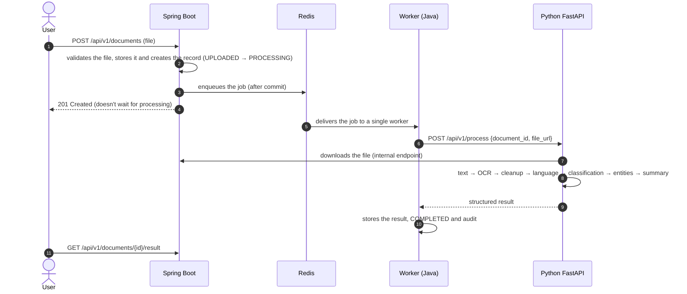

[🇪🇸 Español](README.md) | **🇬🇧 English**

# DocuMind AI — Intelligent Document Processing Platform


An intelligent document processing platform. You upload an invoice, a contract, a résumé, a receipt, an
ID document or a report (digital or scanned PDF, image, DOCX or TXT) and the platform extracts the text
(with OCR when needed), detects the document type, extracts its structured data and generates a summary,
all asynchronously.

It's a **hybrid architecture**: the business backend is in **Java + Spring Boot** and the intelligent
processing in a **Python + FastAPI** microservice.

| Piece | Responsibility |
|---|---|
| **Java** | Business and backend: users, organizations, permissions, documents, states, jobs, audit and public API |
| **Python** | AI and document processing: text, OCR, language, classification, entities and summary |
| **PostgreSQL** | Persistence: metadata, processing runs, results (JSONB) and audit |
| **Redis** | Job queue, idempotency, rate limiting, caching and temporary processing state |
| **Docker** | Infrastructure: the whole system starts with a single command |

## Contents

- [What problem does it solve?](#what-problem-does-it-solve)
- [Why Java and Python?](#why-java-and-python)
- [Architecture](#architecture)
- [Processing flow](#processing-flow)
- [Technologies](#technologies)
- [How to run](#how-to-run)
- [Environment variables](#environment-variables)
- [API](#api)
- [Examples](#examples)
- [Testing](#testing)
- [Docker](#docker)
- [Observability](#observability)
- [Project structure](#project-structure)
- [Known limitations](#known-limitations)
- [Author](#author)
- [License](#license)

## What problem does it solve?

Companies receive documents every day that someone has to read and transcribe: supplier invoices,
contracts, candidates' résumés, expense receipts, ID documents. It's slow, error-prone work.

DocuMind AI automates that work:

- **Detects the document type** automatically (`INVOICE`, `CONTRACT`, `RESUME`, `RECEIPT`,
  `IDENTIFICATION`, `REPORT`, `OTHER`) or uses the one the user specifies.
- **Extracts the relevant data for each type** (invoice number, supplier, totals and taxes; a contract's
  parties, term and clauses; a résumé's skills and contact details...) into a flexible model.
- **Summarizes the document** in a few sentences.
- **Reads scanned documents** with OCR and works without an LLM; if one is configured, it uses it to
  improve classification, fill in fields and write the summary.
- All with **multi-user support and organizations**, audit, resilient asynchronous processing and
  observability.

## Why Java and Python?

Each language does what it's strongest at:

- **Java + Spring Boot** for the business core: mature transactions, security (Spring Security + JWT),
  validation, JPA, resilience (Resilience4j) and observability (Micrometer). It owns the data and the
  rules.
- **Python + FastAPI** for processing: the document and AI ecosystem is in Python (Tesseract, pypdf,
  pdfium, python-docx, langdetect, LLM clients).

Separating them also has operational advantages: processing (OCR, LLM) is CPU-hungry and can be scaled
separately without touching the API, and a failure of the AI service doesn't take down the platform:
documents end up `FAILED` with a clear code and can be retried.

Python does **not** manage users, permissions or organizations: it receives a document and returns a
result.

## Architecture



Key points (details in [docs/architecture.md](docs/architecture.md)):

- **Truly asynchronous.** Uploading a document responds in milliseconds; the processing is done by a
  worker consuming a **Redis Streams** queue with a consumer group. The queue sits behind the
  `ProcessingJobQueue` interface, so it can be swapped for RabbitMQ or Kafka without touching the logic.
- **Never processed twice or stuck.** State machine, idempotency key (`X-Idempotency-Key`), optimistic
  locking, a partial unique index in PostgreSQL and a maintenance process that re-queues orphan messages
  and marks stuck processing runs as failed.
- **Resilient Java → Python communication.** `AiProcessingClient` with timeouts, exponential-backoff
  retries and a circuit breaker (Resilience4j). If Python goes down, the circuit opens and jobs fail
  instantly instead of waiting for timeouts.
- **Layered security.** JWT with rotated refresh tokens, `ADMIN`/`USER` roles, each user only sees their
  documents, an internal key between services, the Python service isn't published outside the Docker
  network, SSRF protection, file validation by binary signature and rate limiting.
- **Optional, controlled LLM.** The pipeline works with local algorithms; the LLM only fills in what the
  rules don't find, and its values are validated and only accepted if they appear in the document.

### State machine



## Processing flow



Upload, processing and failure diagrams: [docs/sequence-diagrams.md](docs/sequence-diagrams.md).

AI service pipeline:

1. **Text extraction**: PDF and DOCX text layer; **OCR** (Tesseract, Spanish and English) only for images
   and scanned pages.
2. **Cleanup**: Unicode normalization, words split by OCR, spaces and lines.
3. **Language**: hybrid detection (statistical + a custom Spanish and English vocabulary).
4. **Classification**: weighted keyword rules with a confidence level; the LLM is only consulted if
   confidence is low.
5. **Entities**: one extractor per document type; the LLM can fill in empty fields.
6. **Summary**: LLM, or a sentence built from the entities plus the most representative sentences.

## Technologies

| Area | Technologies |
|---|---|
| Backend | Java 21, Spring Boot 3.5, Spring Web, Spring Data JPA, Spring Security, JWT (jjwt), Bean Validation, Flyway, Maven |
| Resilience | Resilience4j (Retry, Circuit Breaker), RestClient with timeouts |
| AI service | Python 3.12, FastAPI, Pydantic, httpx, Tesseract (pytesseract), pypdf, pypdfium2, python-docx, langdetect |
| LLM | Any OpenAI-compatible API (OpenAI, Groq, OpenRouter, Ollama...) — optional |
| Data | PostgreSQL 16 (JSONB), Redis 7 (Streams, cache, counters) |
| Frontend | Angular 21 (standalone, signals), nginx |
| Observability | Spring Boot Actuator, Micrometer, Prometheus, Grafana, JSON logs with correlation ID |
| Testing | JUnit 5, Mockito, Spring Boot Test, Testcontainers, WireMock, Awaitility, pytest |
| Infrastructure | Docker, Docker Compose |

## How to run

Requirements: Docker with Docker Compose.

```bash
git clone git@github.com:samsenpro/ai-document-processing-platform.git
cd ai-document-processing-platform
cp .env.example .env        # fill in the secrets (see the next table)
docker compose up -d --build
```

| Service | URL |
|---|---|
| Web application | http://localhost:4300 |
| API and Swagger UI | http://localhost:8096/swagger-ui.html |
| Grafana (user `admin`) | http://localhost:3006 |
| Prometheus | http://localhost:9096 |

Create an account in the web application (an organization's first account is its ADMIN) and upload a
document.

### With a local LLM (optional)

```bash
# In .env: LLM_BASE_URL=http://ollama:11434/v1 and LLM_MODEL=qwen2.5:1.5b
docker compose --profile ollama up -d --build
```

The `ollama` profile starts Ollama and downloads the model only once into a volume. Any OpenAI-compatible
provider also works by setting `LLM_BASE_URL`, `LLM_MODEL` and `LLM_API_KEY`.

## Environment variables

| Variable | Description |
|---|---|
| `POSTGRES_DB`, `POSTGRES_USER`, `POSTGRES_PASSWORD` | Database (the password is required) |
| `REDIS_HOST`, `REDIS_PORT` | Redis (`redis:6379` in Docker) |
| `JWT_SECRET` | HMAC secret for the JWTs, 32 bytes minimum (`openssl rand -base64 48`) |
| `AI_SERVICE_URL` | AI service URL (`http://python-ai:8000`) |
| `AI_SERVICE_API_KEY` | Internal key between Java and Python, 32 characters minimum (`openssl rand -hex 32`) |
| `LLM_API_KEY`, `LLM_MODEL`, `LLM_BASE_URL` | LLM provider (optional; empty = local algorithms only) |
| `GRAFANA_ADMIN_PASSWORD` | Password of Grafana's `admin` user |
| `FILE_STORAGE_PATH` | File storage path (`/storage/documents`, a Docker volume) |

Optional: `AI_SERVICE_READ_TIMEOUT` (120 s), `JWT_ACCESS_TOKEN_TTL` (15 min), `JWT_REFRESH_TOKEN_TTL`
(7 days), `WORKER_CONCURRENCY` (2), `RATE_LIMIT_UPLOADS_PER_MINUTE` (20), `RATE_LIMIT_PROCESS_PER_MINUTE`
(10) and the published ports (`WEB_HOST_PORT`, `API_HOST_PORT`...). The `.env` file is never committed to
the repository.

## API

Full reference, error codes and limits: [docs/api.md](docs/api.md). Swagger UI:
http://localhost:8096/swagger-ui.html.

| Method | Route | Description |
|---|---|---|
| POST | `/api/v1/auth/register` · `/login` · `/refresh` | Authentication with JWT and rotated refresh tokens |
| POST | `/api/v1/documents` | Uploads a document (and queues it for processing) |
| GET | `/api/v1/documents` | Paginated list with status and type filters |
| GET | `/api/v1/documents/{id}` | Detail with the latest processing attempt |
| DELETE | `/api/v1/documents/{id}` | Deletes the document, its file and its result |
| GET | `/api/v1/documents/stats` | Statistics for the dashboard |
| POST | `/api/v1/documents/{id}/process` | Processes or retries (202, asynchronous) |
| GET | `/api/v1/documents/{id}/processing` | Status, real-time stage and attempt history |
| GET | `/api/v1/documents/{id}/result` | Structured result |
| GET | `/api/v1/organizations/me/users` · `/api/v1/audit-logs` | Members and audit (ADMIN) |
| GET | `/actuator/health` · `/actuator/metrics` | Health and metrics |

Errors follow RFC 7807 with a stable `code` and the request's `correlationId`.

## Examples

```bash
API=http://localhost:4300

# 1. Sign-up: creates the organization and returns the tokens
TOKEN=$(curl -s -X POST $API/api/v1/auth/register -H 'Content-Type: application/json' \
  -d '{"email":"ana@acme.com","password":"S3cure-Passw0rd!","fullName":"Ana Gómez","organizationName":"ACME S.A.S."}' \
  | jq -r .accessToken)

# 2. Upload: responds instantly with the document in PROCESSING
ID=$(curl -s -X POST $API/api/v1/documents -H "Authorization: Bearer $TOKEN" \
  -H "X-Idempotency-Key: invoice-march-001" -F "file=@invoice.pdf" | jq -r .id)

# 3. Processing status (real-time stage from Redis)
curl -s $API/api/v1/documents/$ID/processing -H "Authorization: Bearer $TOKEN" | jq '{documentStatus, stage}'

# 4. Result
curl -s $API/api/v1/documents/$ID/result -H "Authorization: Bearer $TOKEN" | jq '{documentType, confidence, entities, summary}'
```

Real result for an invoice (no LLM, local algorithms only; the test documents are in Spanish):

```json
{
  "documentType": "INVOICE",
  "confidence": 0.99,
  "entities": {
    "invoice_number": "FE-10234",
    "supplier": "ACME SOLUCIONES S.A.S.",
    "customer": "Industrias Andinas LTDA",
    "date": "2026-03-15",
    "subtotal": 3500000,
    "tax": 665000,
    "total": 4165000,
    "currency": "COP"
  },
  "summary": "Factura FE-10234 emitida por ACME SOLUCIONES S.A.S. a Industrias Andinas LTDA el 2026-03-15 por un total de 4.165.000 COP."
}
```

And for a contract in DOCX:

```json
{
  "documentType": "CONTRACT",
  "entities": {
    "parties": ["INMOBILIARIA LOS ANDES S.A.S.", "Juan Carlos Pérez Gómez"],
    "start_date": "2026-02-01",
    "end_date": "2027-01-31",
    "contract_type": "arrendamiento de vivienda urbana",
    "important_clauses": ["CLÁUSULA PRIMERA - OBJETO", "CLÁUSULA SEGUNDA - CANON", "CLÁUSULA TERCERA - DURACIÓN", "CLÁUSULA CUARTA - TERMINACIÓN"]
  }
}
```

## Testing

| Suite | What it covers | Count |
|---|---|---|
| Backend (`./mvnw verify`) | Authentication and authorization, file upload and validation, end-to-end asynchronous processing, retries, circuit breaker, timeouts, idempotency, rate limiting, internal endpoint, state machine, PostgreSQL constraints (JSONB, partial unique index), Redis state and cache, absence of N+1 queries, queue restart | 68 tests |
| AI service (`pytest`) | PDF/image/DOCX/TXT extraction, real OCR with Tesseract, classification, per-type extraction, anchoring of LLM values, summary, language, SSRF protection, LLM client, API, errors, correlation ID and metrics | 126 tests |

The backend integration tests use **Testcontainers** (real PostgreSQL and Redis) and **WireMock** to
simulate the AI service with its real contract.

```bash
# Backend (requires Docker)
cd backend-java && ./mvnw verify

# AI service (the test image includes Tesseract)
docker build --target test -t documind-ai-test ai-service
docker run --rm documind-ai-test
```

The full system was also verified with Docker Compose: 7 real documents (digital PDF, scanned PDF, image,
DOCX and TXT) processed end to end with and without an LLM (Ollama with `qwen2.5:1.5b`), an AI service
outage with the circuit breaker opening and recovering, an API restart with jobs in progress, and a check
of logs and metrics.

## Docker

`docker compose up -d --build` starts:

| Service | Image | Published |
|---|---|---|
| `web` | Compiled Angular served by an unprivileged nginx | `4300` |
| `java-api` | Spring Boot (JRE 21, unprivileged user) | `127.0.0.1:8096` |
| `python-ai` | FastAPI + Tesseract (unprivileged user) | Not published (internal network only) |
| `postgres` | PostgreSQL 16 | `127.0.0.1:5450` |
| `redis` | Redis 7 with AOF (the queue survives restarts) | `127.0.0.1:6390` |
| `prometheus` | Prometheus 3.5 | `127.0.0.1:9096` |
| `grafana` | Grafana 12 with provisioned datasource and dashboard | `127.0.0.1:3006` |
| `ollama` (`ollama` profile) | Optional local LLM | Not published |

Every service has a healthcheck and `restart: unless-stopped`. The API waits for PostgreSQL, Redis and
the AI service to be healthy, and has a 60 s grace period on shutdown to finish in-flight jobs.

## Observability

- **Business metrics**: `documents_uploaded_total`, `documents_processed_total` (by type),
  `documents_failed_total` (by error code), `processing_duration_seconds`, `ai_requests_total`,
  `ai_request_errors_total`, circuit breaker state, plus HTTP, JVM and connection pool metrics.
- **AI service**: total and per-step pipeline duration, pages with OCR, LLM calls and errors
  (`documind_ai_*`).
- **Grafana dashboard** "DocuMind AI - Overview" provisioned automatically.
- **Structured JSON logs** in both services with `correlation_id`: the HTTP request ID travels in the job,
  in the call to Python and in the file download, so an upload can be followed end to end:

```bash
docker compose logs java-api python-ai | grep <correlation_id>
```

## Project structure

```text
.
├── backend-java/          Main API (Spring Boot)
│   └── src/main/java/com/documind/
│       ├── auth/  user/  organization/  document/  processing/  ai/  audit/
│       ├── config/  exception/  common/
├── ai-service/            AI service (FastAPI)
│   ├── app/  api/  core/  services/  models/  ocr/  llm/  main.py
│   └── tests/
├── frontend/              Web application (Angular)
├── infrastructure/        Prometheus and Grafana
├── docs/                  architecture.md · api.md · sequence-diagrams.md
├── docker-compose.yml
└── .env.example
```

## Known limitations

- File storage is local (a Docker volume). Several API instances need shared storage (S3/MinIO)
  implementing `FileStorageService`.
- The rule-based extractors cover common formats in Spanish (Colombia) and English; documents with other
  layouts rely on the LLM to fill in fields.
- With a small local model (`qwen2.5:1.5b`) the LLM is slow on CPU (10-40 s per document) and the
  **generated summary** can contain inaccuracies (for example, naming a currency the document doesn't
  mention). The extracted data is validated against the text; the summary is free text. For production a
  larger model or an external provider is recommended.
- OCR quality depends on the image: there's no advanced preprocessing (deskewing, noise removal).
- Prometheus and Grafana are configured for development.

## Author

- **LinkedIn:** [samuel-martinez-beleno](https://www.linkedin.com/in/samuel-martinez-beleno/)
- **GitHub:** [samsenpro](https://github.com/samsenpro)

## License

Distributed under the MIT license. See the [LICENSE](LICENSE) file.
