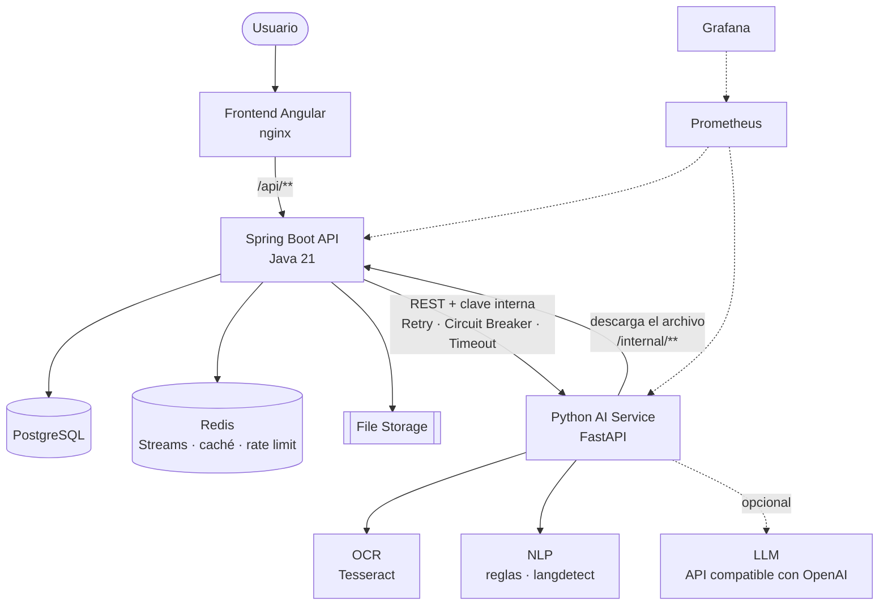
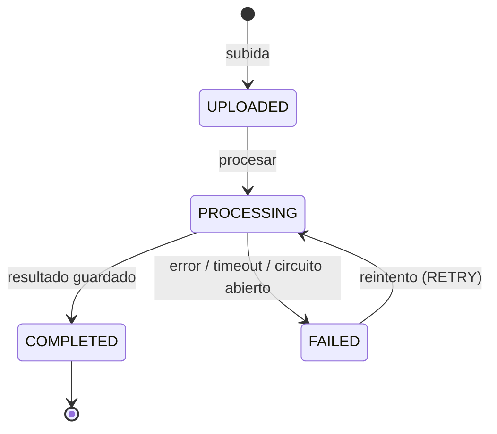
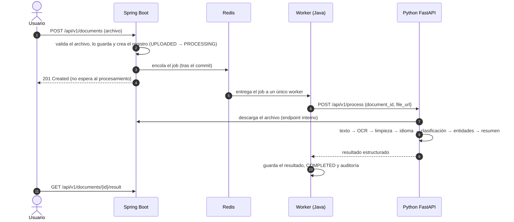

# DocuMind AI — Intelligent Document Processing Platform


Plataforma de procesamiento inteligente de documentos. Subes una factura, un contrato, una hoja de vida,
un recibo, un documento de identidad o un informe (PDF digital o escaneado, imagen, DOCX o TXT) y la
plataforma extrae el texto (con OCR cuando hace falta), detecta el tipo de documento, extrae sus datos
estructurados y genera un resumen, todo de forma asíncrona.

Es una **arquitectura híbrida**: el backend de negocio está en **Java + Spring Boot** y el procesamiento
inteligente en un microservicio **Python + FastAPI**.

| Pieza | Responsabilidad |
|---|---|
| **Java** | Negocio y backend: usuarios, organizaciones, permisos, documentos, estados, jobs, auditoría y API pública |
| **Python** | IA y procesamiento de documentos: texto, OCR, idioma, clasificación, entidades y resumen |
| **PostgreSQL** | Persistencia: metadatos, procesamientos, resultados (JSONB) y auditoría |
| **Redis** | Cola de jobs, idempotencia, rate limiting, caché y estado temporal del procesamiento |
| **Docker** | Infraestructura: todo el sistema se levanta con un solo comando |

## Contenido

- [¿Qué problema resuelve?](#qué-problema-resuelve)
- [¿Por qué Java y Python?](#por-qué-java-y-python)
- [Arquitectura](#arquitectura)
- [Flujo de procesamiento](#flujo-de-procesamiento)
- [Tecnologías](#tecnologías)
- [Cómo ejecutar](#cómo-ejecutar)
- [Variables de entorno](#variables-de-entorno)
- [API](#api)
- [Ejemplos](#ejemplos)
- [Testing](#testing)
- [Docker](#docker)
- [Observabilidad](#observabilidad)
- [Estructura del proyecto](#estructura-del-proyecto)
- [Limitaciones conocidas](#limitaciones-conocidas)
- [Autor](#autor)
- [Licencia](#licencia)

## ¿Qué problema resuelve?

Las empresas reciben a diario documentos que alguien tiene que leer y transcribir: facturas de
proveedores, contratos, hojas de vida de candidatos, recibos de gastos, documentos de identidad. Es un
trabajo lento y propenso a errores.

DocuMind AI automatiza ese trabajo:

- **Detecta el tipo de documento** automáticamente (`INVOICE`, `CONTRACT`, `RESUME`, `RECEIPT`,
  `IDENTIFICATION`, `REPORT`, `OTHER`) o usa el que indique el usuario.
- **Extrae los datos relevantes de cada tipo** (número de factura, proveedor, totales e impuestos; partes,
  vigencia y cláusulas de un contrato; habilidades y contacto de una hoja de vida...) en un modelo flexible.
- **Resume el documento** en unas frases.
- **Lee documentos escaneados** con OCR y funciona sin LLM; si se configura uno, lo usa para mejorar la
  clasificación, completar campos y redactar el resumen.
- Todo con **multiusuario y organizaciones**, auditoría, procesamiento asíncrono resiliente y observabilidad.

## ¿Por qué Java y Python?

Cada lenguaje hace aquello en lo que es más fuerte:

- **Java + Spring Boot** para el núcleo de negocio: transacciones, seguridad (Spring Security + JWT),
  validación, JPA, resiliencia (Resilience4j) y observabilidad (Micrometer) maduras. Es el dueño de los
  datos y de las reglas.
- **Python + FastAPI** para el procesamiento: el ecosistema de documentos e IA está en Python (Tesseract,
  pypdf, pdfium, python-docx, langdetect, clientes de LLM).

Separarlos tiene además ventajas operativas: el procesamiento (OCR, LLM) consume CPU y se puede escalar
por separado sin tocar la API, y un fallo del servicio de IA no tumba la plataforma: los documentos quedan
en `FAILED` con un código claro y se pueden reintentar.

Python **no** gestiona usuarios, permisos ni organizaciones: recibe un documento y devuelve un resultado.

## Arquitectura



Puntos clave (el detalle está en [docs/architecture.md](docs/architecture.md)):

- **Asíncrono de verdad.** Subir un documento responde en milisegundos; el procesamiento lo hace un worker
  que consume una cola de **Redis Streams** con grupo de consumidores. La cola está detrás de la
  interfaz `ProcessingJobQueue`, así que se puede cambiar por RabbitMQ o Kafka sin tocar la lógica.
- **Nunca se procesa dos veces ni se queda bloqueado.** Máquina de estados, clave de idempotencia
  (`X-Idempotency-Key`), bloqueo optimista, índice único parcial en PostgreSQL y un proceso de
  mantenimiento que reencola mensajes huérfanos y marca como fallidos los procesamientos atascados.
- **Comunicación Java → Python resiliente.** `AiProcessingClient` con timeouts, reintentos con espera
  exponencial y circuit breaker (Resilience4j). Si Python cae, el circuito se abre y los jobs fallan al
  instante en lugar de esperar timeouts.
- **Seguridad por capas.** JWT con refresh tokens rotados, roles `ADMIN`/`USER`, cada usuario solo ve sus
  documentos, clave interna entre servicios, el servicio Python no se publica fuera de la red de Docker,
  protección SSRF, validación de archivos por firma binaria y rate limiting.
- **LLM opcional y controlado.** El pipeline funciona con algoritmos locales; el LLM solo completa lo que
  las reglas no encuentran, sus valores se validan y solo se aceptan si aparecen en el documento.

### Máquina de estados



## Flujo de procesamiento



Diagramas de subida, procesamiento y fallo: [docs/sequence-diagrams.md](docs/sequence-diagrams.md).

Pipeline del servicio de IA:

1. **Extracción de texto**: capa de texto de PDF y DOCX; **OCR** (Tesseract, español e inglés) solo para
   imágenes y páginas escaneadas.
2. **Limpieza**: normalización Unicode, palabras partidas por el OCR, espacios y líneas.
3. **Idioma**: detección híbrida (estadística + vocabulario propio del español y el inglés).
4. **Clasificación**: reglas con palabras clave ponderadas y nivel de confianza; el LLM solo se consulta
   si la confianza es baja.
5. **Entidades**: un extractor por tipo de documento; el LLM puede completar los campos vacíos.
6. **Resumen**: LLM, o una frase construida con las entidades más las frases más representativas.

## Tecnologías

| Área | Tecnologías |
|---|---|
| Backend | Java 21, Spring Boot 3.5, Spring Web, Spring Data JPA, Spring Security, JWT (jjwt), Bean Validation, Flyway, Maven |
| Resiliencia | Resilience4j (Retry, Circuit Breaker), RestClient con timeouts |
| Servicio de IA | Python 3.12, FastAPI, Pydantic, httpx, Tesseract (pytesseract), pypdf, pypdfium2, python-docx, langdetect |
| LLM | Cualquier API compatible con OpenAI (OpenAI, Groq, OpenRouter, Ollama...) — opcional |
| Datos | PostgreSQL 16 (JSONB), Redis 7 (Streams, caché, contadores) |
| Frontend | Angular 21 (standalone, signals), nginx |
| Observabilidad | Spring Boot Actuator, Micrometer, Prometheus, Grafana, logs JSON con correlation ID |
| Testing | JUnit 5, Mockito, Spring Boot Test, Testcontainers, WireMock, Awaitility, pytest |
| Infraestructura | Docker, Docker Compose |

## Cómo ejecutar

Requisitos: Docker con Docker Compose.

```bash
git clone git@github.com:samsenpro/ai-document-processing-platform.git
cd ai-document-processing-platform
cp .env.example .env        # rellena los secretos (ver la tabla siguiente)
docker compose up -d --build
```

| Servicio | URL |
|---|---|
| Aplicación web | http://localhost:4300 |
| API y Swagger UI | http://localhost:8096/swagger-ui.html |
| Grafana (usuario `admin`) | http://localhost:3006 |
| Prometheus | http://localhost:9096 |

Crea una cuenta en la aplicación web (la primera cuenta de una organización es su ADMIN) y sube un
documento.

### Con un LLM local (opcional)

```bash
# En .env: LLM_BASE_URL=http://ollama:11434/v1 y LLM_MODEL=qwen2.5:1.5b
docker compose --profile ollama up -d --build
```

El perfil `ollama` levanta Ollama y descarga el modelo una sola vez en un volumen. También sirve cualquier
proveedor compatible con OpenAI indicando `LLM_BASE_URL`, `LLM_MODEL` y `LLM_API_KEY`.

## Variables de entorno

| Variable | Descripción |
|---|---|
| `POSTGRES_DB`, `POSTGRES_USER`, `POSTGRES_PASSWORD` | Base de datos (la contraseña es obligatoria) |
| `REDIS_HOST`, `REDIS_PORT` | Redis (`redis:6379` en Docker) |
| `JWT_SECRET` | Secreto HMAC de los JWT, mínimo 32 bytes (`openssl rand -base64 48`) |
| `AI_SERVICE_URL` | URL del servicio de IA (`http://python-ai:8000`) |
| `AI_SERVICE_API_KEY` | Clave interna entre Java y Python, mínimo 32 caracteres (`openssl rand -hex 32`) |
| `LLM_API_KEY`, `LLM_MODEL`, `LLM_BASE_URL` | Proveedor de LLM (opcional; vacío = solo algoritmos locales) |
| `GRAFANA_ADMIN_PASSWORD` | Contraseña del usuario `admin` de Grafana |
| `FILE_STORAGE_PATH` | Ruta de almacenamiento de archivos (`/storage/documents`, volumen de Docker) |

Opcionales: `AI_SERVICE_READ_TIMEOUT` (120 s), `JWT_ACCESS_TOKEN_TTL` (15 min), `JWT_REFRESH_TOKEN_TTL`
(7 días), `WORKER_CONCURRENCY` (2), `RATE_LIMIT_UPLOADS_PER_MINUTE` (20), `RATE_LIMIT_PROCESS_PER_MINUTE`
(10) y los puertos publicados (`WEB_HOST_PORT`, `API_HOST_PORT`...). El archivo `.env` nunca se sube al
repositorio.

## API

Referencia completa, códigos de error y límites: [docs/api.md](docs/api.md). Swagger UI:
http://localhost:8096/swagger-ui.html.

| Método | Ruta | Descripción |
|---|---|---|
| POST | `/api/v1/auth/register` · `/login` · `/refresh` | Autenticación con JWT y refresh tokens rotados |
| POST | `/api/v1/documents` | Sube un documento (y lo encola para procesar) |
| GET | `/api/v1/documents` | Lista paginada con filtros por estado y tipo |
| GET | `/api/v1/documents/{id}` | Detalle con el último intento de procesamiento |
| DELETE | `/api/v1/documents/{id}` | Borra el documento, su archivo y su resultado |
| GET | `/api/v1/documents/stats` | Estadísticas para el dashboard |
| POST | `/api/v1/documents/{id}/process` | Procesa o reintenta (202, asíncrono) |
| GET | `/api/v1/documents/{id}/processing` | Estado, etapa en tiempo real e historial de intentos |
| GET | `/api/v1/documents/{id}/result` | Resultado estructurado |
| GET | `/api/v1/organizations/me/users` · `/api/v1/audit-logs` | Miembros y auditoría (ADMIN) |
| GET | `/actuator/health` · `/actuator/metrics` | Salud y métricas |

Los errores siguen RFC 7807 con un `code` estable y el `correlationId` de la petición.

## Ejemplos

```bash
API=http://localhost:4300

# 1. Registro: crea la organización y devuelve los tokens
TOKEN=$(curl -s -X POST $API/api/v1/auth/register -H 'Content-Type: application/json' \
  -d '{"email":"ana@acme.com","password":"S3cure-Passw0rd!","fullName":"Ana Gómez","organizationName":"ACME S.A.S."}' \
  | jq -r .accessToken)

# 2. Subida: responde al instante con el documento en PROCESSING
ID=$(curl -s -X POST $API/api/v1/documents -H "Authorization: Bearer $TOKEN" \
  -H "X-Idempotency-Key: factura-marzo-001" -F "file=@factura.pdf" | jq -r .id)

# 3. Estado del procesamiento (etapa en tiempo real desde Redis)
curl -s $API/api/v1/documents/$ID/processing -H "Authorization: Bearer $TOKEN" | jq '{documentStatus, stage}'

# 4. Resultado
curl -s $API/api/v1/documents/$ID/result -H "Authorization: Bearer $TOKEN" | jq '{documentType, confidence, entities, summary}'
```

Resultado real de una factura (sin LLM, solo algoritmos locales):

```json
{
  "documentType": "INVOICE",
  "confidence": 0.99,
  "entities": {
    "invoice_number": "FE-10234",
    "supplier": "ACME SOLUCIONES S.A.S.",
    "customer": "Industrias Andinas LTDA",
    "date": "2026-03-15",
    "subtotal": 3500000,
    "tax": 665000,
    "total": 4165000,
    "currency": "COP"
  },
  "summary": "Factura FE-10234 emitida por ACME SOLUCIONES S.A.S. a Industrias Andinas LTDA el 2026-03-15 por un total de 4.165.000 COP."
}
```

Y de un contrato en DOCX:

```json
{
  "documentType": "CONTRACT",
  "entities": {
    "parties": ["INMOBILIARIA LOS ANDES S.A.S.", "Juan Carlos Pérez Gómez"],
    "start_date": "2026-02-01",
    "end_date": "2027-01-31",
    "contract_type": "arrendamiento de vivienda urbana",
    "important_clauses": ["CLÁUSULA PRIMERA - OBJETO", "CLÁUSULA SEGUNDA - CANON", "CLÁUSULA TERCERA - DURACIÓN", "CLÁUSULA CUARTA - TERMINACIÓN"]
  }
}
```

## Testing

| Suite | Qué cubre | Cantidad |
|---|---|---|
| Backend (`./mvnw verify`) | Autenticación y autorización, subida y validación de archivos, procesamiento asíncrono de punta a punta, reintentos, circuit breaker, timeouts, idempotencia, rate limiting, endpoint interno, máquina de estados, restricciones de PostgreSQL (JSONB, índice único parcial), estado y caché en Redis, ausencia de consultas N+1, reinicio de la cola | 68 tests |
| Servicio de IA (`pytest`) | Extracción de PDF/imagen/DOCX/TXT, OCR real con Tesseract, clasificación, extracción por tipo, anclaje de valores del LLM, resumen, idioma, protección SSRF, cliente de LLM, API, errores, correlation ID y métricas | 126 tests |

Los tests de integración del backend usan **Testcontainers** (PostgreSQL y Redis reales) y **WireMock**
para simular el servicio de IA con su contrato real.

```bash
# Backend (requiere Docker)
cd backend-java && ./mvnw verify

# Servicio de IA (la imagen de tests incluye Tesseract)
docker build --target test -t documind-ai-test ai-service
docker run --rm documind-ai-test
```

Además se verificó el sistema completo con Docker Compose: 7 documentos reales (PDF digital, PDF
escaneado, imagen, DOCX y TXT) procesados de punta a punta con y sin LLM (Ollama con `qwen2.5:1.5b`),
caída del servicio de IA con apertura del circuit breaker y recuperación, reinicio de la API con jobs en
curso, y comprobación de logs y métricas.

## Docker

`docker compose up -d --build` levanta:

| Servicio | Imagen | Publicado |
|---|---|---|
| `web` | Angular compilado servido por nginx sin privilegios | `4300` |
| `java-api` | Spring Boot (JRE 21, usuario sin privilegios) | `127.0.0.1:8096` |
| `python-ai` | FastAPI + Tesseract (usuario sin privilegios) | No se publica (solo red interna) |
| `postgres` | PostgreSQL 16 | `127.0.0.1:5450` |
| `redis` | Redis 7 con AOF (la cola sobrevive a reinicios) | `127.0.0.1:6390` |
| `prometheus` | Prometheus 3.5 | `127.0.0.1:9096` |
| `grafana` | Grafana 12 con datasource y dashboard provisionados | `127.0.0.1:3006` |
| `ollama` (perfil `ollama`) | LLM local opcional | No se publica |

Todos los servicios tienen healthcheck y `restart: unless-stopped`. La API espera a que PostgreSQL, Redis
y el servicio de IA estén sanos, y tiene 60 s de gracia al detenerse para terminar los jobs en curso.

## Observabilidad

- **Métricas de negocio**: `documents_uploaded_total`, `documents_processed_total` (por tipo),
  `documents_failed_total` (por código de error), `processing_duration_seconds`, `ai_requests_total`,
  `ai_request_errors_total`, estado del circuit breaker, y las métricas HTTP, JVM y del pool de conexiones.
- **Servicio de IA**: duración total y por paso del pipeline, páginas con OCR, llamadas al LLM y errores
  (`documind_ai_*`).
- **Dashboard de Grafana** "DocuMind AI - Overview" provisionado automáticamente.
- **Logs estructurados** en JSON en ambos servicios con `correlation_id`: el ID de la petición HTTP viaja
  en el job, en la llamada a Python y en la descarga del archivo, así que una subida se sigue de punta a
  punta:

```bash
docker compose logs java-api python-ai | grep <correlation_id>
```

## Estructura del proyecto

```text
.
├── backend-java/          API principal (Spring Boot)
│   └── src/main/java/com/documind/
│       ├── auth/  user/  organization/  document/  processing/  ai/  audit/
│       ├── config/  exception/  common/
├── ai-service/            Servicio de IA (FastAPI)
│   ├── app/  api/  core/  services/  models/  ocr/  llm/  main.py
│   └── tests/
├── frontend/              Aplicación web (Angular)
├── infrastructure/        Prometheus y Grafana
├── docs/                  architecture.md · api.md · sequence-diagrams.md
├── docker-compose.yml
└── .env.example
```

## Limitaciones conocidas

- El almacenamiento de archivos es local (volumen de Docker). Para varias instancias de la API hace falta
  un almacenamiento compartido (S3/MinIO) implementando `FileStorageService`.
- Los extractores por reglas cubren formatos habituales en español (Colombia) e inglés; documentos con otra
  maquetación dependen del LLM para completar campos.
- Con un modelo local pequeño (`qwen2.5:1.5b`) el LLM es lento en CPU (10-40 s por documento) y el
  **resumen generado** puede contener imprecisiones (por ejemplo, nombrar una moneda que el documento no
  menciona). Los datos extraídos sí se validan contra el texto; el resumen es texto libre. Para producción
  se recomienda un modelo mayor o un proveedor externo.
- La calidad del OCR depende de la imagen: no hay preprocesado avanzado (enderezado, eliminación de ruido).
- Prometheus y Grafana están configurados para desarrollo.

## Autor

- **LinkedIn:** [samuel-martinez-beleno](https://www.linkedin.com/in/samuel-martinez-beleno/)
- **GitHub:** [samsenpro](https://github.com/samsenpro)

## Licencia

Distribuido bajo la licencia MIT. Consulta el archivo [LICENSE](LICENSE).
