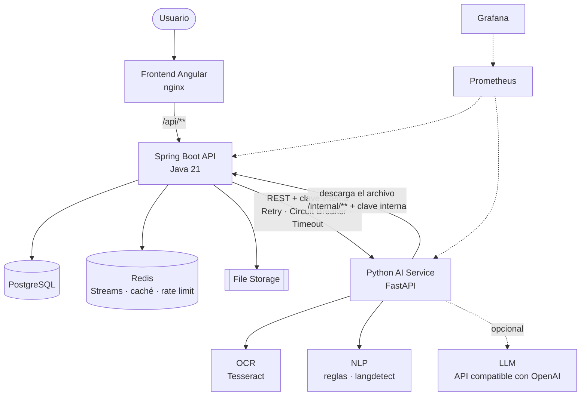
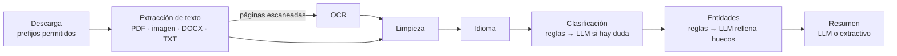

# Arquitectura

DocuMind AI es una arquitectura híbrida de dos servicios con responsabilidades separadas:

| Componente | Responsabilidad |
|---|---|
| **Java (Spring Boot)** | Negocio: usuarios, organizaciones, permisos, documentos, estados, jobs, auditoría y API pública |
| **Python (FastAPI)** | Procesamiento inteligente: extracción de texto, OCR, idioma, clasificación, entidades y resumen |
| **PostgreSQL** | Persistencia (metadatos, procesamientos, resultados en JSONB, auditoría) |
| **Redis** | Cola de jobs (Streams), idempotencia, rate limiting, caché y estado temporal del procesamiento |
| **Almacenamiento de archivos** | Los binarios nunca van a PostgreSQL: volumen local detrás de `FileStorageService` |
| **Prometheus + Grafana** | Métricas de negocio y técnicas de ambos servicios |



## Por qué dos servicios

- **Java** aporta lo que un backend empresarial necesita: transacciones, seguridad declarativa,
  validación, JPA, un ecosistema maduro de resiliencia (Resilience4j) y observabilidad.
- **Python** tiene el ecosistema de procesamiento de documentos e IA (Tesseract, pypdf, pdfium,
  python-docx, langdetect, clientes de LLM).
- Separarlos permite escalarlos por separado: el procesamiento es intensivo en CPU (OCR) y se puede
  replicar sin tocar la API. Python no conoce usuarios ni permisos: recibe un documento y devuelve un
  resultado.

## Backend Java

```
com.documind
├── auth/          registro, login, refresh (rotación), JWT, filtros de seguridad
├── user/          usuarios y roles (ADMIN, USER)
├── organization/  organización y alta de miembros por el ADMIN
├── document/      documentos, validación de archivos, máquina de estados, almacenamiento
├── processing/    jobs, worker, transiciones, resultados, reaper, estado temporal en Redis
│   └── queue/     ProcessingJobQueue (contrato) y RedisStreamJobQueue (implementación)
├── ai/            AiProcessingClient (contrato) y cliente HTTP con Resilience4j
├── audit/         registro de eventos y consulta para el ADMIN
├── config/        seguridad, OpenAPI, caché, interceptores
├── exception/     códigos de error y respuestas RFC 7807
└── common/        idempotencia, rate limiting, correlation ID, métricas, entidad base
```

### Decisiones principales

- **Procesamiento asíncrono.** Subir o reprocesar un documento responde en milisegundos (201/202): se
  crea un `DocumentProcessing` en estado `QUEUED` y, **tras el commit**, se publica un job en un Redis
  Stream. Publicarlo antes del commit permitiría que un worker lo recibiera antes de que exista en la
  base de datos (o que procesara algo que después se deshizo).
- **Cola desacoplada.** La lógica solo conoce `ProcessingJobQueue`. La implementación actual usa Redis
  Streams con un grupo de consumidores (cada job lo recibe un único worker aunque haya varias
  instancias) y ACK después de procesar. Sustituirla por RabbitMQ o Kafka es añadir otra
  implementación y otro consumidor que llame a `ProcessingWorker`.
- **Entrega al menos una vez + worker idempotente.** El worker solo actúa si el procesamiento está en
  `QUEUED` y lo pasa a `RUNNING` con bloqueo optimista: un mensaje duplicado se descarta. Ningún error
  deja el documento en `PROCESSING`: todo termina en `COMPLETED` o `FAILED` con un código de error.
- **Nada se queda bloqueado.** Al detenerse, la API espera a que terminen los jobs en curso (60 s de
  gracia en Docker) y, al arrancar, reencola los mensajes que quedaron sin confirmar para sus propios
  consumidores. `StaleProcessingReaper` reclama y reencola los mensajes de instancias que no volvieron y
  marca `FAILED (PROCESSING_TIMEOUT)` los procesamientos que superan el tiempo máximo en cola (20 min) o
  en ejecución (10 min). El usuario puede reintentarlos.
- **Máquina de estados** en `DocumentStatus`: `UPLOADED → PROCESSING → COMPLETED | FAILED`,
  `FAILED → PROCESSING` (reintento). `COMPLETED` es final. Tres capas evitan procesar dos veces el
  mismo documento: la máquina de estados (409), la clave de idempotencia (`X-Idempotency-Key`) y un
  índice único parcial en PostgreSQL (un solo procesamiento activo por documento).
- **Comunicación con Python** siempre a través de `AiProcessingClient` (RestClient con HTTP/1.1,
  timeout de conexión y de lectura). Resilience4j aplica `Retry` (errores de conexión, timeouts y 5xx)
  alrededor de un `CircuitBreaker`: si Python cae, tras varios fallos el circuito se abre y los jobs
  siguientes fallan al instante (`AI_SERVICE_CIRCUIT_OPEN`) sin esperar timeouts. Los 4xx (documento
  no procesable) no se reintentan ni cuentan como fallo del servicio.
- **El archivo no viaja en la petición.** Java envía a Python una `file_url` a su endpoint interno
  `/internal/v1/documents/{id}/content`. Ese endpoint solo acepta la clave interna (nunca un JWT) y solo
  entrega documentos en `PROCESSING`. Con S3 o MinIO la URL sería una URL prefirmada.
- **Resultados flexibles.** Cada tipo de documento tiene campos distintos, así que las entidades se
  guardan en JSONB y se pueden consultar con los operadores de PostgreSQL.
- **Acceso a documentos** centralizado en `DocumentAccess`: un USER ve los suyos y un ADMIN los de su
  organización. Un documento ajeno responde 404 (no 403) para no revelar que existe.
- **Auditoría** en la misma transacción que la operación (si se deshace, no queda rastro falso). Guarda
  el `document_id` sin clave foránea para sobrevivir al borrado del documento.

### Uso de Redis

| Clave | Uso |
|---|---|
| `documind:processing:jobs` (Stream) | Cola de jobs con el grupo `documind-workers` |
| `document:processing:{id}` (hash, TTL 1 h) | Etapa en tiempo real: `QUEUED`, `CALLING_AI_SERVICE`, `SAVING_RESULT`, `COMPLETED`, `FAILED` |
| `idempotency:{scope}:{user}:{key}` | Reserva (`SET NX`) y resultado de las peticiones idempotentes (24 h) |
| `ratelimit:{policy}:{user o ip}` | Contador de ventana fija, incremento y expiración atómicos con Lua |
| `cache:document-results::{id}` | Caché del resultado (inmutable una vez completado; se invalida al borrar) |
| `auth:refresh:{sha256}` | Refresh tokens: solo se guarda su hash |

## Servicio de IA (Python)

```
app
├── api/        endpoints /api/v1/process y /api/v1/health
├── core/       configuración, seguridad (clave interna), logging JSON, correlation ID, métricas, errores
├── models/     contrato HTTP (Pydantic) y modelos internos del pipeline
├── ocr/        OcrService (contrato) y TesseractOcrService
├── llm/        LlmService (contrato), cliente compatible con OpenAI y servicio desactivado
└── services/   descarga, extracción de texto, limpieza, idioma, clasificación, entidades y resumen
```

Pipeline:



- **OCR solo cuando hace falta.** Se usa la capa de texto de PDFs y DOCX; solo las imágenes y las
  páginas escaneadas (poco texto y con imágenes) pasan por Tesseract.
- **El LLM es opcional y nunca imprescindible.** Sin `LLM_BASE_URL` el servicio funciona con sus
  algoritmos locales. Con LLM: la clasificación solo lo consulta si las reglas no alcanzan la confianza
  mínima; la extracción le pide únicamente los campos que las reglas no encontraron (un valor anclado en
  el texto nunca se sustituye por uno generado) y todo lo que devuelve se valida por tipo. Si el LLM
  falla, el pipeline sigue con las reglas y lo indica en `metadata.warnings`.
- **Contenido no confiable.** El texto del documento se envía al LLM delimitado y con la instrucción
  de no seguir órdenes que contenga (prompt injection).
- **Protección SSRF.** El servicio adjunta la clave interna al descargar, así que solo acepta URLs bajo
  los prefijos permitidos, normaliza la ruta (`../`) y no sigue redirecciones.

## Seguridad

- JWT de vida corta (15 min) y refresh tokens opacos con rotación; cada refresh invalida el anterior.
- Contraseñas con BCrypt; login con el mismo error para email inexistente y contraseña incorrecta.
- Dos cadenas de filtros: la API pública (JWT) y `/internal/**` (solo clave interna, comparación en
  tiempo constante).
- El servicio Python no se publica fuera de la red de Docker; nginx solo expone `/api/**`.
- Archivos validados por su firma binaria (no por el Content-Type declarado); nombres saneados; la clave
  de almacenamiento no contiene datos del usuario.
- Rate limiting por usuario en subida y procesamiento, y por IP en login, registro y refresh.
- Errores sin trazas ni mensajes internos; logs sin secretos ni contenido de documentos.

## Observabilidad

- **Métricas de negocio** (Java): `documents_uploaded_total`, `documents_processed_total`,
  `documents_failed_total`, `processing_duration_seconds`, `ai_requests_total`, `ai_request_errors_total`,
  además de HTTP, JVM, HikariCP y el estado del circuit breaker.
- **Métricas del pipeline** (Python): `documind_ai_*` (duración total y por paso, OCR, llamadas al LLM,
  errores por código).
- **Logs estructurados** en JSON en ambos servicios con `correlation_id`: el ID de la petición HTTP viaja
  en el job, en la llamada a Python y en la descarga del archivo, así que una subida se sigue de punta a
  punta entre servicios.
- **Dashboard de Grafana** provisionado automáticamente (`infrastructure/grafana`).

## Limitaciones conocidas

- El almacenamiento de archivos es local (volumen de Docker). Para varias instancias de la API hace
  falta un almacenamiento compartido (S3/MinIO) implementando `FileStorageService`.
- Los extractores por reglas cubren formatos habituales en español (Colombia) e inglés; documentos con
  maquetación muy distinta dependen del LLM para completar campos.
- La calidad del OCR depende de la imagen (resolución, inclinación). No hay preprocesado avanzado
  (enderezado, eliminación de ruido).
- El dashboard de Grafana y Prometheus están pensados para desarrollo (sin autenticación en Prometheus).
