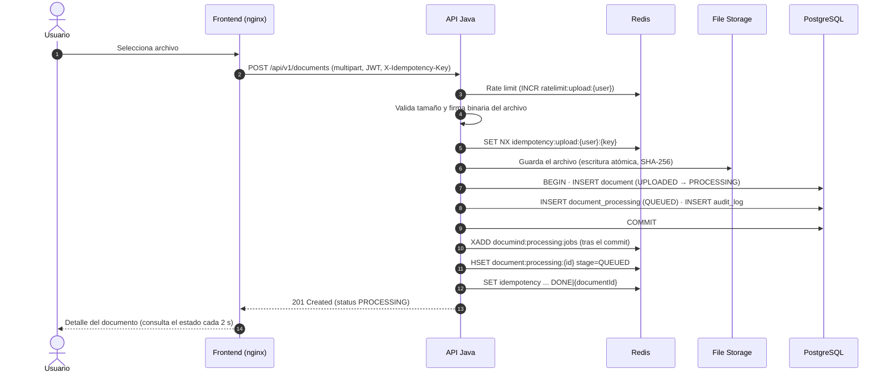
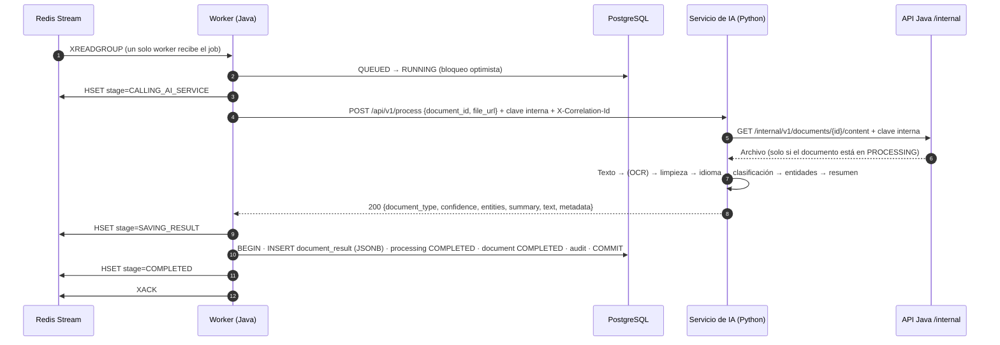
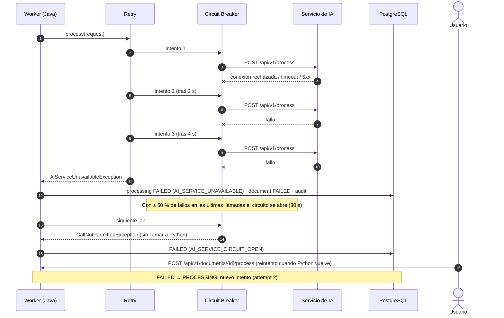

# Diagramas de secuencia

## Subida de un documento

La petición termina en cuanto el documento está guardado y el job creado; el procesamiento ocurre
después, en segundo plano.

## Procesamiento de un documento

## Fallo del procesamiento

Si Python no responde, Resilience4j reintenta con espera exponencial; cuando el circuito se abre, los
jobs siguientes fallan al instante. Ningún documento queda bloqueado en `PROCESSING`.

Los errores del propio documento (formato no soportado, PDF corrupto, sin texto) llegan como 4xx: no
se reintentan, no abren el circuito y el procesamiento termina en `FAILED` con el código que devuelve
Python (`UNSUPPORTED_FORMAT`, `NO_TEXT_EXTRACTED`...).
